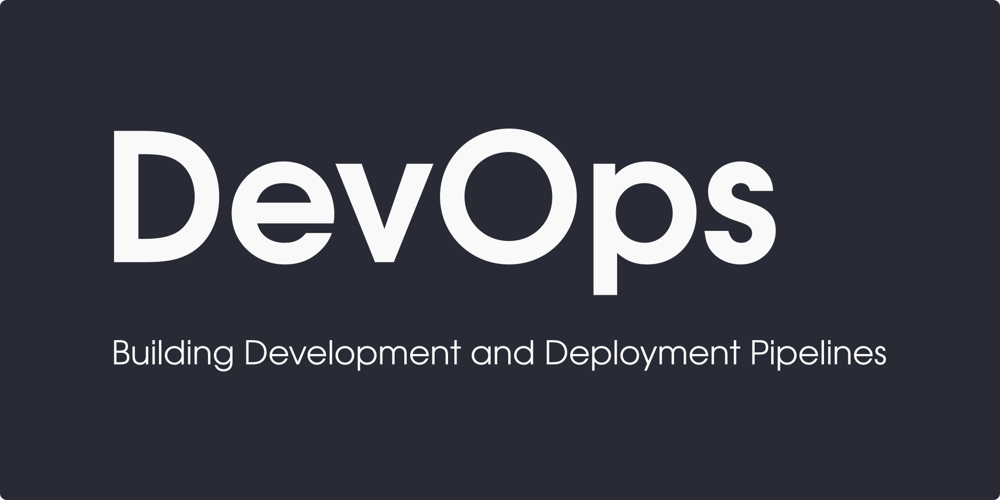

# DevOps

This repository is for DevOps projects and snippets.

## Cloud Native

This repository is focused on cloud-native approach, meaning applications that are design to work in the cloud.

## Production Runtime

The projects in the repository can be used in production systems.

## Development and Deployment Pipelines

This repository contains development and deployment pipelines.

### How to contribute?

You may contribute to this repository with your projects, clone and PR.

#### Disclaimer

The information on this repository and the resources available for download through the repository are for educational and general informational purposes only. They are not intended as and shall not be understood or construed as professional and legal advice.

The owner and contributors of this repository will not be held liable for any losses or damages caused by acting or failing to act on the grounds of the content of this repository.
